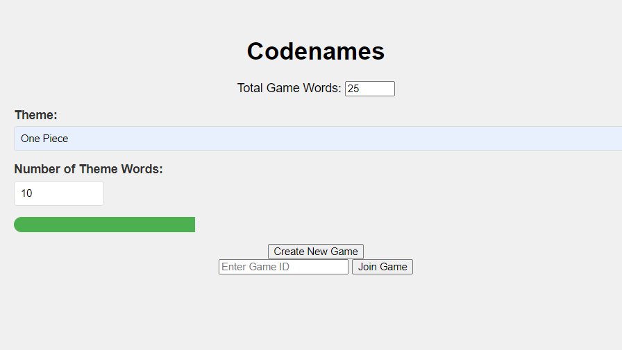
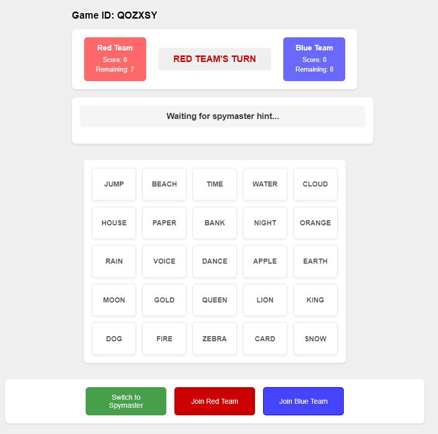

# NameCode Project

Welcome to **NameCode**, an interactive word game where teams compete to find words based on hints provided by a spymaster. This project involves multiple features, including a point system, live dashboard, team and spymaster functionality, and more. It's designed to bring an engaging experience to players by leveraging the power of AI and a dynamic user interface.

## Features

- **Point System**: Tracks the progress of each team and scores based on correct guesses.
- **Live Dashboard**: Displays real-time updates of the game state for all players.
- **Live Spymaster Hints**: Spymaster are able to send hints in turns for either blue or red team with number of words they want the operators to guess.
- **Team and Spymaster Roles**: Allows players to take on different roles (team members and spymasters) with distinct privileges.
- **Game End Condition**: The game ends when the team reveals the black card word.
- **AI-Generated Word Lists**: A list of words will be dynamically generated using AI to ensure a variety of game scenarios.
- **Hugging Face Local Inference**: The game leverages the **TinyLlama** chat model from Hugging Face to locally generate words for the game. By running inference on the model locally, we ensure real-time, diverse word generation without the need for external API calls. This allows for smoother gameplay and greater control over the generated content.
- **Network Access**: Open the game to everyone in your network. 






## Getting Started

Follow the instructions below to get the project up and running.

### Prerequisites

Ensure you have the following installed before running the project:

- **Python >= 3.6**

### Setup Instructions

1. **Clone the Repository**:

   ```bash
   git clone https://github.com/your-repository/NameCode.git
   cd namecode
   ```

2. **Network Configuration (for WSL Users)**:
If you're running the game from Windows Subsystem for Linux (WSL), please refer to the unofficial documentation for configuring the network properly: https://www.notion.so/NameCode-Project-1600acc9f57d80f0afe8c84c46ab8890

Install Dependencies:

```bash
python3 -m venv myenv
source venv/bin/activate
pip install -r requirements.txt
```
Run the Application:
```bash
python3 app.py
```

3. **Access the Game:** Open a browser and navigate to https://localhost:5000 to access the live game.
